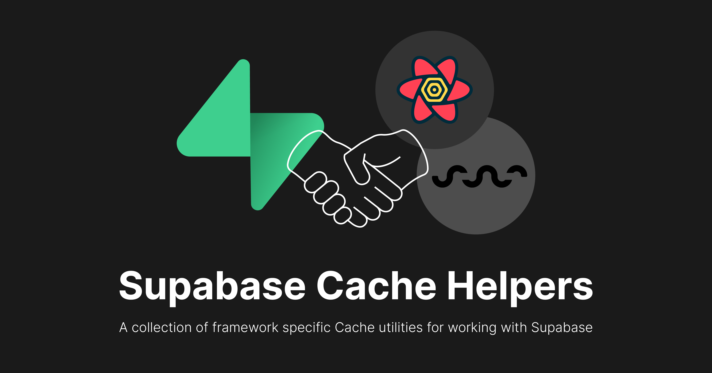

# Supabase Cache Helpers

**A collection of framework specific Cache utilities for working with <a href="https://supabase.com" alt="Supabase" target="\_parent">Supabase</a>.**

## Introduction

The cache helpers bridge the gap between popular frontend cache management solutions such as [SWR](https://swr.vercel.app) or [React Query](https://tanstack.com/query/latest), and the Supabase client libraries. All features of [`postgrest-js`](https://github.com/supabase/postgrest-js), [`storage-js`](https://github.com/supabase/storage-js) and [`realtime-js`](https://github.com/supabase/realtime-js) are supported. It also provides a simple server-side abstraction to cache queries to the `PostgREST` API. The cache helpers parse any query into a unique and definite query key, and automatically populates your query cache with every mutation using implicit knowledge of the schema.

## Features

With just one single line of code, you can simplify the logic of **fetching, subscribing to updates, and mutating data as well as storage objects** in your project, and have all the amazing features of [SWR](https://swr.vercel.app) or [React Query](https://tanstack.com/query/latest) out-of-the-box.

- **Seamless** integration with [SWR](https://swr.vercel.app) and [React Query](https://tanstack.com/query/latest)
- Support for **Server-Side** queries
- **Automatic** cache key generation
- Easy **Pagination** and **Infinite Scroll** queries
- **Insert**, **update**, **upsert** and **delete** mutations
- **Smart revalidation** of cache after mutations and subscriptions
- One-liner to upload, download and remove **Supabase Storage** objects

And a lot [more](https://psteinroe.github.io/supabase-cache-helpers/).

---

**View full documentation and examples on [psteinroe.github.io/supabase-cache-helpers](https://psteinroe.github.io/supabase-cache-helpers/).**

 

## 📦 Packages

The cache helpers are split up into reusable libraries.

### Primary Packages

- [`postgrest-swr`](./packages/postgrest-swr/README.md): [SWR](https://swr.vercel.app) wrapper for [postgrest-js](https://github.com/supabase/postgrest-js).
- [`storage-swr`](./packages/storage-swr/README.md): [SWR](https://swr.vercel.app) wrapper for storage [storage-js](https://github.com/supabase/storage-js)
- [`postgrest-react-query`](./packages/postgrest-react-query/README.md): [React Query](https://tanstack.com/query/latest) wrapper for [postgrest-js](https://github.com/supabase/postgrest-js)
- [`storage-react-query`](./packages/storage-react-query/README.md): [React Query](https://tanstack.com/query/latest) wrapper for storage [storage-js](https://github.com/supabase/storage-js)
- [`postgrest-server`](./packages/postgrest-server/README.md): Server-side caching wrapper for [postgrest-js](https://github.com/supabase/postgrest-js).

### Shared Packages

These are not meant for direct usage.

- `postgrest-core`: shared logic for [postgrest-js](https://github.com/supabase/postgrest-js)
- `storage-core`: shared logic for [storage-js](https://github.com/supabase/storage-js) operations
- `tsconfig`: `tsconfig.json`s used throughout the monorepo

Each package/app is 100% [TypeScript](https://www.typescriptlang.org/).

## ❤️ Sponsors

<table>
  <tr>
    <td align="center">
      
       
      <b>Mateo</b>
       
      (we are <a href="https://twitter.com/psteinroe">hiring</a>!)
    </td>
  </tr>
</table>
